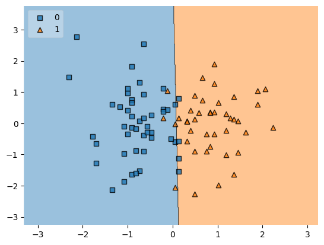

# Student Placement Prediction using Logistic Regression

## What this project does

- Takes a student's CGPA and IQ score as input
- Predicts whether the student will get placed (1) or not (0)
- Uses Logistic Regression to make the prediction
- Saves the trained model as a `.pkl` file so it can be reused later

---

## Dataset

- File used: `placement.csv`
- Total rows: 100
- Columns used:
  - `cgpa` - student's grade point average (ranges from 3.3 to 8.5)
  - `iq` - student's IQ score (ranges from 37 to 233)
  - `placement` - target column, 1 means placed, 0 means not placed

---

## Steps followed in the notebook

- Loaded the dataset using pandas
- Removed the unnecessary index column
- Plotted a scatter plot of CGPA vs IQ to visually see the data split

  

- Split features (CGPA, IQ) and target (placement)
- Divided data into train and test sets (90% train, 10% test)
- Applied Standard Scaler to normalize the input features
- Trained a Logistic Regression model on the training data
- Checked predictions on the test set
- Measured accuracy using `accuracy_score`
- Plotted decision regions to see how the model separates the two classes

  

- Saved the trained model using `pickle` as `clv_model.pkl`

---

## Libraries used

- `numpy`
- `pandas`
- `matplotlib`
- `scikit-learn`
- `mlxtend`
- `pickle`

---

## How to run

- Clone the repo
- Make sure all the libraries above are installed
- Place `placement.csv` in the working directory
- Open `ML_clove.ipynb` in Jupyter or Google Colab and run all cells

---

## Output

- The trained model is saved as `clv_model.pkl`
- This file can be loaded later to make predictions without retraining
